<div align="center">




<br/>

<a href="https://www.linkedin.com/in/rafael-ruiz-da-silva-64a142225/">
  
</a>
<a href="https://github.com/RafaelRuizSilva?tab=repositories">
  
</a>


</div>

<br/>

## 🧬 Sobre mim

```python
class RafaelRuiz(DataScientist):
    def __init__(self):
        self.formacao   = "Ciência da Computação"
        self.foco       = ["Machine Learning", "Deep Learning", "MLOps"]
        self.dominios   = ["visão computacional", "NLP", "séries temporais"]
        self.atualmente = "estudando Transformers por dentro — atenção incluída 🧠"

    def missao(self) -> str:
        return "transformar informação em valor"
```

- 🔍 **Análise exploratória e limpeza de dados** — porque todo bom modelo começa com dados bem tratados
- 🧠 **Deep learning aplicado** a imagens, texto e séries temporais
- ⚙️ **Automação, pipelines e deploy** — do notebook à produção
- 📊 **Dashboards interativos e storytelling** com dados

<br/>

## 🚀 Projetos em destaque

<table>
<tr>
<td width="50%" valign="top">

### 🧠 The Transformer Lab 

Laboratório interativo que **disseca um Transformer em 15 etapas ao vivo no navegador**: tokenização, embeddings, atenção multi-head (Q·Kᵀ/√d), residuais, feed-forward e geração autorregressiva — com heatmaps clicáveis mostrando cada conta de verdade.

   

[](https://github.com/RafaelRuizSilva/The-Transformer-Lab)
[](https://the-transformer-lab.vercel.app)

</td>
<td width="50%" valign="top">

### ☁️ ML Lifecycle Diagram 

O diagrama do **AWS Well-Architected ML Lens transformado em ferramenta de estudo interativa**: 15 componentes clicáveis (Feature Store, Model Registry, Lineage Tracker...), modo aula guiada e quiz de 8 perguntas para fixar o ciclo de vida de ML.

   

[](https://github.com/RafaelRuizSilva/lifecycle-ml-diagram)
[](https://lifecycle-ml-diagram.vercel.app)

</td>
</tr>
<tr>
<td width="50%" valign="top">

### 🔎 Assistente de Assinaturas

Sistema inteligente para **validar assinaturas (genuínas ou forjadas)** combinando segmentação com ResUnet e classificação com ResNet50 + SVM, servido via Streamlit.

   

[](https://github.com/RafaelRuizSilva/assistente-assinaturas-deploy)

</td>
<td width="50%" valign="top">

### 🎮 Mauá Esports

Projeto interdisciplinar do Instituto Mauá de Tecnologia: **plataforma full-stack para a equipe de esports**, com API em Flask, front em Angular e infraestrutura em Docker.

    

[](https://github.com/RafaelRuizSilva/IMT-MauaEsports-S2)

</td>
</tr>
</table>

<br/>

## 🛠️ Arsenal

<div align="center">

**Linguagens & ML**


**Web & APIs**


**Dados & Infra**


</div>

<br/>

## 📊 Estatísticas

<div align="center">


</div>

<br/>

## 🐍 Contribuições sendo devoradas

<div align="center">

<picture>
  <source media="(prefers-color-scheme: dark)" srcset="https://raw.githubusercontent.com/RafaelRuizSilva/RafaelRuizSilva/output/github-snake-dark.svg"/>
  <source media="(prefers-color-scheme: light)" srcset="https://raw.githubusercontent.com/RafaelRuizSilva/RafaelRuizSilva/output/github-snake.svg"/>
  
</picture>

</div>

<br/>

<div align="center">


**Feito com 💙 por alguém que acredita no poder dos dados.**

`model.fit(curiosidade, dedicacao)  # loss diminuindo a cada commit`

</div>
